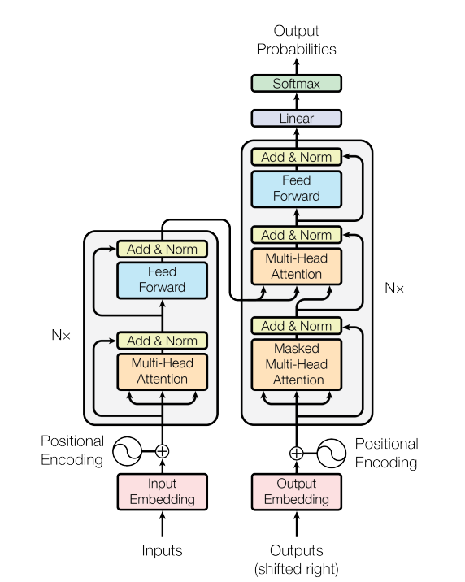

Source: [my github](https://github.com/Avenger-py)


## Title

This is test blog, just testing some random stuff. hello world
Letsss goooooooooooooooooooooooooooooooooooooooooooooooooo
yo yo wassup heloooooooooooooo

The sun dipped below the horizon, casting a warm, golden glow across the tranquil lake. Birds chirped softly in the distance as a gentle breeze rustled through the leaves of the ancient oak trees. In the middle of the clearing, a small, weathered cabin stood, its wooden walls etched with stories of the past. Inside, the fireplace crackled with a comforting fire, casting dancing shadows on the walls. The scent of pine and earth filled the air, blending with the aroma of freshly baked bread cooling on the kitchen counter. Outside, a deer cautiously stepped into the clearing, pausing to listen before continuing to drink from the crystal-clear water. The peaceful scene was a perfect retreat from the chaos of everyday life, a reminder of the beauty and serenity that nature offers.

## lol lmao

HELL YEAH !!

1. very important point

2. even more important point

3. we testing this freakin website letsgooooooooo

## self attention code

```python
class SelfAttention(nn.Module):
    """
    Input: normalized tensor (B, T, N_embd)

        Attention_params: Q, K, V --> (B, N_head, T, H_size)

        Attention: Softmax(Masking((Q @ K)/sqrt(size_K))) @ V

        Projection: (B, N_head, T, H_size) --> (B, T, N_embd) & N_embd = N_head * H_size

    Output: normalized tensor (B, T, N_embd)

    """
    def __init__(self, config):
        super().__init__()
        assert config.N_embd % config.N_head == 0
        self.emb_size = config.N_embd
        self.N_head = config.N_head
        self.H_size = config.N_embd // config.N_head
        self.qkv = nn.Linear(self.emb_size, self.emb_size * 3, bias=config.bias)
        self.proj = nn.Linear(self.emb_size, self.emb_size, bias=config.bias)
        self.attn_dropout = nn.Dropout(config.dropout)
        self.proj_dropout = nn.Dropout(config.dropout)

    def forward(self, x):
        B, T = x.size()[0], x.size()[1]
        qkv = self.qkv(x)
        q, k, v = qkv.chunk(3, dim=-1)
        # Q, K, V --> (B, N_head, T, H_size)
        q = q.view(B, T, self.N_head, self.H_size).transpose(1, 2)
        k = k.view(B, T, self.N_head, self.H_size).transpose(1, 2)
        v = v.view(B, T, self.N_head, self.H_size).transpose(1, 2)

        # (B, N_head, T, H_size) @ (B, N_head, H_size , T) --> (B, N_head, T, T)
        raw_scores = q @ k.transpose(-2, -1) / self.H_size**0.5
        raw_scores = F.softmax(raw_scores.masked_fill(torch.tril(raw_scores, diagonal=0) == 0, float('-inf')), dim=-1)
        raw_scores = self.attn_dropout(raw_scores)

        # (B, N_head, T, T) @ (B, N_head, T, H_size) --> (B, N_head, T, H_size)
        attention = raw_scores @ v
        attention = self.proj_dropout(self.proj(attention.transpose(1, 2).contiguous().view(B, T, self.emb_size)))
        return attention
```

## Image

